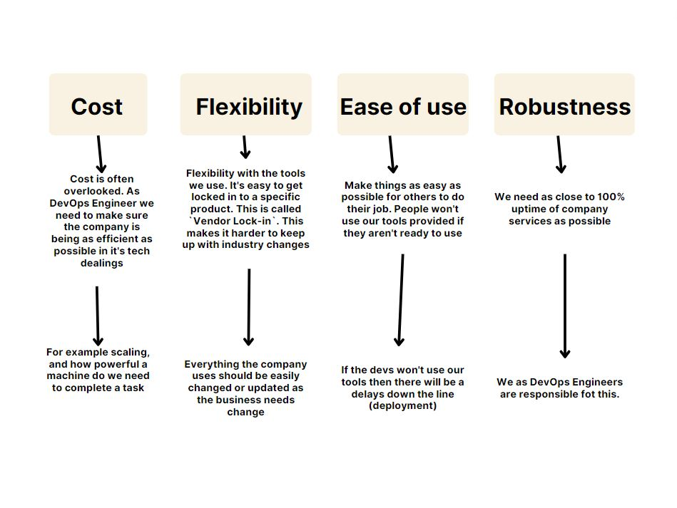
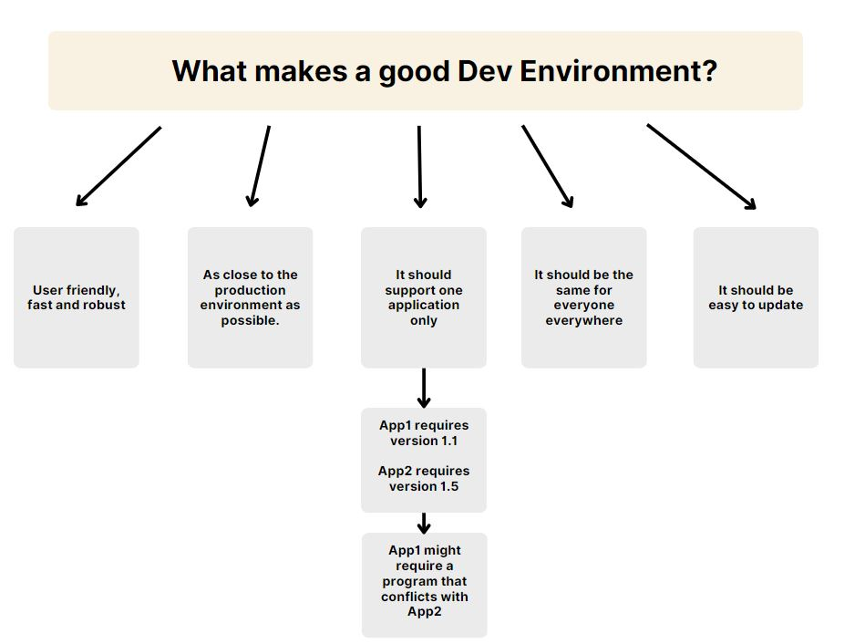
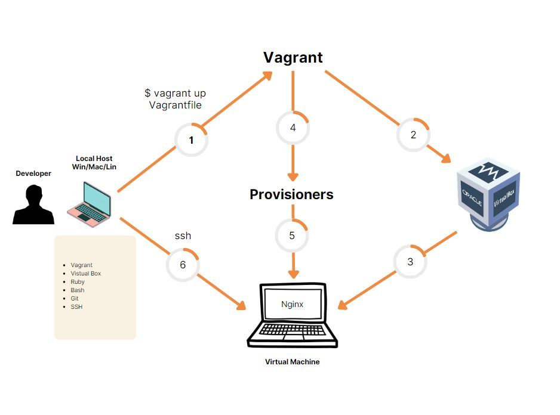
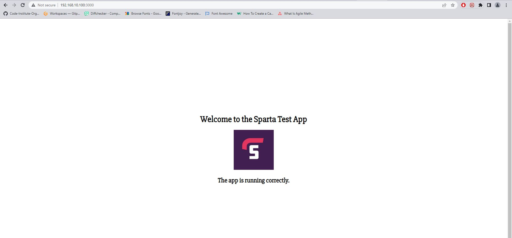
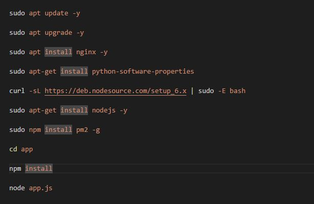
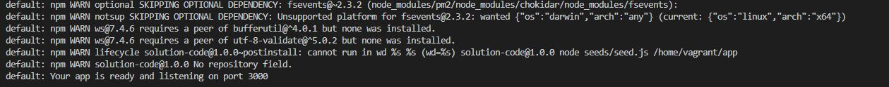

# Virtualisation

## 4 Pillars of DevOps

Four main pillars of a good DevOps practice:

* Cost - development is more cost effective
* Flexibility - easy to change tools or processes if required
* Ease of use - tools are easy to use for the developers or anyone else in the team
* Robustness - maximize comapny services' uptime, ideally 100% uptime 

## What is a Virtual Machine?

Virtual Machine is a virual environment that functions as a virtual computer system with it's own own CPU, RAM and storage created on the physical hardware system.
It uses `Hypervisor`, which installed on top of the local OS, in order to allocate the resources to the virtual machines.
Virtual machines are completely isolated, meaning VM is not aware it is build on top of the local OS or there are any other VM created. This way if anything goes wrong with the VM it wont affect local OS or any other VM.

You can create multiple VMs on the same computer and you can share resources between them, but you can only share whatever resources are available for you. If you have only 8Gb or RAM available, it means you can only share up to 8Gb of memory with VMs.

_There are 2 types of `Hypervisors`:_

* Type 1 - also knows as `Bare Metal`, is a hypervisor installed directly on the hardware, meaning there is no OS between hypervisor and hardware

* Type 2 - hypervisor installed on the machine with it's own OS and it uses this OS in order to communicate with hardware and allocate the resources

## What is Development Environment?

Development Environment is a workspace for developers to make changes without breaking anything in a live environment.

Development Environment should be used when you want to make any changes to your software without affecting your users. To create a development environment developers usually make a copy of the application on their local machine where they can do any extrame changes and test them before releasing them to the live environment. 
Depending on the size of the project there might be multiple environments. In some cases you might also have a "Staging" environment, it is done in the critical project to ensure that new code goes through an extra layer of testing before going into the live environment.

### What makes a good Dev Environment?

## Using Vagrant and VirtualBox

By using Vagrant and VirtualBox you can create a Virtual Machine localy to use it as a development environment. For that you need a local machine with Visual Studio, Vagrant, VirtualBox, Ruby, Git, Bash and ssh.

_*! To make sure that everything works you have to start your tools with Admin persmission!*_

To create a Virtual Machine you need to do following steps:

1. Start a Visual Studio and open the folder for your project. Using `bash` terminal you have to intialise your folder with a following command: `vagrant init`. After initialising new file will be created called `Vagrantfile` which will act as a configuration file when creating a Virtual Machine
2. Before creating a VM you need to start a VirtualBox (remember to start it as an Administrator). To create our VM first open `Vagrantfile` and change `config.vm.box` line to be as following: `config.vm.box = "ubuntu/xenial64"`. This way we ensure we will have Ubuntu on our VM. After that type `vagrant up` in your terminal and it should send a command to `VirtualBox` to start a new VM.
3. Once all the set up process is finished the new Virtual Machine should be available for us to use localy.
4. It can be optional, but we can add provisioners in order to automate the set-up of our VM machine by updating and installing any required packages automatically when starting it up. Simillar to "User data" in AWS, we can write a script with commands to be executed when we running up our VM. More on this in the next chapter.
5. If you added any provisions instructions you can either restart your VM or start a new one in order of this script to be executed.
6. Finally, when all of the preparations are done and VM is running we can use `ssh` connection to connect to our VM. To do that we need to use our Bash terminal. Then, use `cd` commands to navigate into your project folder where `Vargantfile` is located and use command `vargant ssh` to connect to VM by `ssh`.

### Create Provisioners

In order to create provisioners I will write two possible ways, however there are more available:

1. Execute the script inside the `Vagrantfile`:

    * Open `Vagrantfile`
    * Create a script inside the file by typing following command:
        * `config.vm.provision "shell", inline: <<-SHELL` - where `config.vm.provision "shell"` says we will execute provisioning shell script; `inline:` tells it will be an executable command; `<<-SHELL` determins the start of the script
        * `sudo apt update -y` - command to update our software
        * `sudo apt upgrade -y` - command to upgrade our software
        * `sudo apt install nginx -y` - install nginx
        * `SHELL`- determins the end of the script
    * After that you can either use `vagrant destroy` to stop your VM and then `vagrant up` to start a new one with your provisioning, or you can use command `vagrant reload --provision` in order to reload your VM with provision in mind

2. Execute a shell script file:
    * Create a new `provisioning.sh` script file in the same folder as your `Vagrantfile`
    * Inside the script file type the following:
        * `sudo apt update -y` - command to update our software
        * `sudo apt upgrade -y` - command to upgrade our software
        * `sudo apt install nginx -y` - install nginx
    * Open `Vagrantfile`  and add the following line underneath your config:
        * `config.vm.provision "shell", path: "provisioning.sh"`
    * After that you can either use `vagrant destroy` to stop your VM and then `vagrant up` to start a new one with your provisioning, or you can use command `vagrant reload --provision` in order to reload your VM with provision in mind

### Adding a private IP to your VM and testing NGINX

In order to test the nginx we need to add an IP to our VM:

1. Open `Vagrantfile`
2. In your config tyoe the following line `config.vm.network "private_network", ip: "192.168.10.100"`. It means we are configuring a private network and giving it an IP address of `192.168.10.100`
3. Restart your VM with `vagrant reload`, or start a new one by using `vagrant destroy` and then `vagrant up`, in order for this changes to take effect
4. Copy that IP address into your web browser and check if nginx is working

### Adding folder that will be ignored by your repo

If there are any file that contain some private information, such as IP adresses, Passwords, etc., you can create a file that will contain the list of all the files and folders you want to be ignored by `git add`, meaining they wont be uploaded to your repository.

To add ignore file you have to:

1. It's optional, but can be a good practice to create a folder called `ignores` (or name whatever you like) that will contain the files you want to be ignored by git
2. Create `.gitignore` file
3. Open the file and list all the folders and files you want to be ignored, for example `/ignores` to select our folder we created
4. Move the files you want to be ignored into `/ignores` folder
5. Now, if you try to use `git` commands your `ignores` folder will be skipped

### Syncing folder with VM
If there is any folder in your VisualStudio that you would like to sync with your VM machine, you can do so by writing a small line of code telling a Vagrant to copy that folder to your VM:

* `config.vm.synced_folder "app", "/home/vagrant/app"` - where:
    * `config.vm.synced_folder "app"` - we are telling Vagrant to sync the folder called `app` when configurating the VM
    * `"home/vagrant/app"` - we are telling the destination where we want to sync this folder to

### Run automated tests and deploy the app

*In VS terminal:*

1. `gem install bundler` - install bundler for tests with Ruby

2. `bundle` - bundle all the test

3.  `rake spec` - run all the tests

*In Bash terminal:*
1. `cd` into your project folder where your `Vagrantfile` located and connect by using `vagrant ssh` command

2.  `sudo apt-get install python-software-properties` - install python software properties

3. `curl -sL https://deb.nodesource.com/setup_6.x | sudo -E bash -` - download a newer version of `nodejs`

4.  `sudo apt-get install nodejs -y`  - install `nodejs` on the VM

5.  `sudo npm install pm2 -g` - install `pm2`

6. `cd app` - navigate into your app folder

7.  `npm install` - use pm2 to install the app

8. `node app.js` - run the app

9. When app is deployed it will say `Your app is redy and listening on port 3000`

10. Go to your web-browser and in the new tab enter the following ip: `192.168.10.100:3000`

11. The app is deployed and you can see it in your browser

## Automate app deployment by using provisioning script

In order to automate all the process I have made some changes to my `provisioning.sh` file by adding all of the above steps.

The final script looks as following:

After you use `vagrant up` command in terminal the VM will be started and will install all of the required packages as well as it will deploy our app in to the nginx server.
If everything is correct you will see the final message as following:

Now, if you go back to your browser and type in the following IP: `192.168.10.100:3000`, you will be able to see your app deployed.