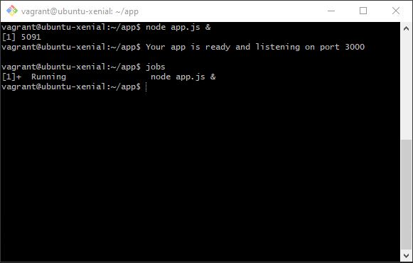
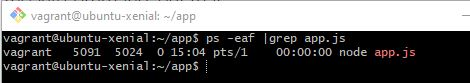
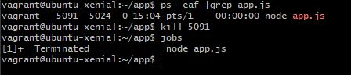
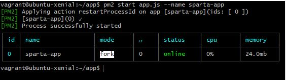
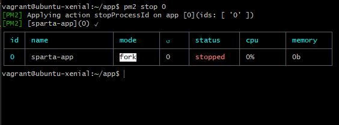

# Creating multiple VMs in Vagrant

To have multiple VM created you need to make some changes to your `Vagrantfile`:

1. Open your `Vagrantfile`
2. At the top of your configuration code write a line of code to define your VM: `config.vm.define "app" do |app|`, where:
    * `config.vm.define "app"` - giving a name "app" to our VM
    * `do |app|` - telling to configurate this VM
3. If you have any code written already that you want to use to configure "app" VM, you have to make sure:
    * You indent all of the written code to be inside  the `define`
    * change all of the `config.vm.` lines to `app.vm.` to ensure it applies changes only to "app" VM
4. If you want to write some new commands use `app.vm.` to configure your VM
5. At the end of your config you need to add `end` on the same line as `config.vm.define "app" do |app|`
6. Your code should look something like:

```
config.vm.define "app" do |app|

    app.vm.box = "ubuntu/xenial64"
    app.vm.network "private_network", ip: "192.168.10.100"

    app.vm.provision "shell", path: "provisioning.sh"

    # syncing the app folder
    app.vm.synced_folder "app", "/home/vagrant/app"
end
```


To add additional VM:
1. Underneath the created VM machine define a new VM by writing `config.vm.define "<name>" do |<name>|`
2. Write configuration code by using `<name>.vm.`
3. Close your configuration with `end` on the same line as `define`
4. Example:
```
config.vm.define "db" do |db|

    db.vm.box = "ubuntu/xenial64"
    db.vm.network "private_network", ip:"192.168.10.150"
    
end
```


## Install MongoDB on a VM

1. Start your `db` VM. You can use `vagrant up` and it will start all of the machines, or you can use `vagrant up db` to only start `db` machine and save time/resources

2. Using Bash terminal, `cd` into the project folder where `Vagrantfile` located

3. Type `vagrant ssh db` to connect to VM. You need to add `db` at the end in order to specify which machine you want to connect to

4. Run `sudo apt update -y` to update linux

5. Run `sudo apt upgrade -y` to upgrade linux

6. Use `sudo apt-key adv --keyserver hkp://keyserver.ubuntu.com:80 --recv D68FA50FEA312927` to give a public key for mongo

7. Use `echo "deb https://repo.mongodb.org/apt/ubuntu xenial/mongodb-org/3.2 multiverse" | sudo tee /etc/apt/sources.list.d/mongodb-org-3.2.list` to verify the key

8. You will receive this message `deb https://repo.mongodb.org/apt/ubuntu xenial/mongodb-org/3.2 multiverse` which shows the destination where it will put the key

9. Use `sudo apt update -y` again to grab mongo

10. Use `sudo apt upgrade -y` to install updates again

11. `sudo apt-get install -y mongodb-org=3.2.20 mongodb-org-server=3.2.20 mongodb-org-shell=3.2.20 mongodb-org-mongos=3.2.20 mongodb-org-tools=3.2.20`  - installs specific version of mongo

12. `sudo systemctl start mongod` - starts mongo

13. `sudo systemctl status mongod` - check status to ensure mongo is running


## Provision MongoDB

1. Inside your project folder create a new folder, in my case its `db_provisioning`, and then inside this folder create a new shell file `provisioning.sh`
2. Open your new `provisioning.sh` file
3. Inside the file type the commands you want to be executed when VM is starting, in our case we will be adding the commands from above, as we want to provision MongoDB. Your script should look something like this:
```
sudo apt update -y 

sudo apt upgrade -y

sudo apt-key adv --keyserver hkp://keyserver.ubuntu.com:80 --recv D68FA50FEA312927

echo "deb https://repo.mongodb.org/apt/ubuntu xenial/mongodb-org/3.2 multiverse" | sudo tee /etc/apt/sources.list.d/mongodb-org-3.2.list

sudo apt update -y 

sudo apt upgrade -y

sudo apt-get install -y mongodb-org=3.2.20 mongodb-org-server=3.2.20 mongodb-org-shell=3.2.20 mongodb-org-mongos=3.2.20 mongodb-org-tools=3.2.20

sudo systemctl start mongod
```
4. Open `Vagrantfile`
5. Inside `Vagrantfile` go to your `db` config and add a following line `db.vm.provision "shell", path: "db_provisioning/provisioning.sh"` to tell the file to run the provisioning script. Your code should look like this:
```
config.vm.define "db" do |db|

    db.vm.box = "ubuntu/xenial64"
    db.vm.network "private_network", ip:"192.168.10.150"
    db.vm.provision "shell", path: "db_provisioning/provisioning.sh"
end 
```
6. Start your VM by using `vagrant up db`
7. Using Bash terminal, `cd` into the project folder where `Vagrantfile` located
8. Type `vagrant ssh db` to connect to VM. You need to add `db` at the end in order to specify which machine you want to connect to
9. Type `sudo systemctl status mongod` to check status to ensure mongo is running


## Running a backgound process in Linux

Here are some ways to run Sparta app in the background

1. Using Linux commands:

    1. Sign in to your VM through Bash terminal using `vagrant ssh app` command
    2. Use `cd app` to navigate inside the app folder
    3. Use `node app.js &` to run the app, where `&` at the end tells to run it in the background. After that press `Enter` again to return to the terminal
    4. Now, if you enter your ip `192.168.10.100:3000` in the browser tab it should take you to Sparta app
    4. You can use `jobs` command to see the active jobs:

    

    To stop the process:
    1. First to kill the procees we need to find it's PID. To do so we can use a command `ps -eaf` and find our running app there, however, the list might be too long it will take some time to find the process. Instead, we can use `ps -eaf |grep app.js` in order to filter our results and show only our app.js info:

    

    2. Now we can use `kill` command with the PID we found in order to stop the process. Command will look like this: `kill 5091`
    3. We can run `jobs` command to verify the process was stopped

    


2. Using pm2 commands:

    1. Sign in to your VM through Bash terminal using `vagrant ssh app` command
    2. Use `cd app` to navigate inside the app folder
    3. Use command `pm2 start app.js --name sparta-app` where at the end we assign the name for this process as `sparta-app`
    4. Now you will see a table that confirms the app is running in the background:

    

    To stop pm2 process:
    1. To stop the app using pm2 we simply need to write command `pm2 stop 0`, where `0` is our app id from the table we can see above
    2. Now it should show us a new table where it confirms the process been stopped:

    


