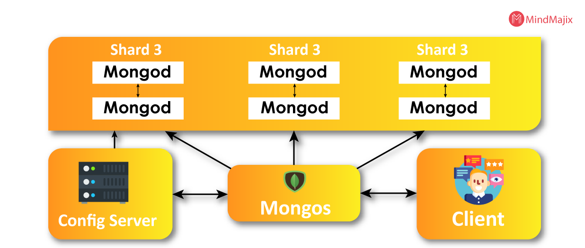

# MongoDB Research

## What is MongoDB?

MongoDB is a non-relational document database that provides support for JSON-like storage. The MongoDB database has a flexible data model that enables you to store unstructured data, and it provides full indexing support, and replication with rich and intuitive APIs.
MongoDB is a document-oriented NoSQL database used for high volume data storage. Instead of using tables and rows as in the traditional relational databases, MongoDB makes use of collections and documents. Documents consist of key-value pairs which are the basic unit of data in MongoDB.

## NoSQL Databases
Databases, which store data in a format different from relational databases, are known as NoSQL databases. NoSQL stands for “not only SQL,” which pertains to the fact that either the database can store and manage data using “no SQL” at all or it can work in a combination that combines the flexibility of the newer approach (NoSQL) with the power of the traditional relational system (SQL).
The major purpose of using a NoSQL database is for distributed data stores with humongous data storage needs. NoSQL is used for Big data and real-time web apps. For example, companies like Twitter, Facebook and Google collect terabytes of user data every single day.

The concept of NoSQL databases became popular with Internet giants like Google, Facebook, Amazon, etc. who deal with huge volumes of data. The system response time becomes slow when you use RDBMS for massive volumes of data.

To resolve this problem, we could “scale up” our systems by upgrading our existing hardware. This process is expensive.

The alternative for this issue is to distribute database load on multiple hosts whenever the load increases. This method is known as “scaling out.”

## History of MongoDB
When Dwight Merriman and Eliot Horowitz were designing web applications at DoubleClick, an online advertising startup now owned by Google Inc., they ran into development and scalability challenges with standard relational database systems. In 2007, Merriman and Horowitz assisted in the formation of 10Gen Inc., a company dedicated to commercializing MongoDB and related products. In 2013, the firm was renamed MongoDB Inc., and in October 2017, it went public under the ticker symbol MDB. The database’s name was taken from the word gargantuan to convey the idea of supporting vast volumes of data.

## Why MongoDB is popular?
1. MongoDB is easy to use - due to it ease of use and flexibility it is popular among new developrs, and it's capabilities still meet all the requirenments of complex modern applications
2. Modern technology stack - most rapidly growing tech stacks use MongoDB
3. Price - MongoDB storage is scalable, meaning you pay for what you are using.

## MongoDB data storage architecture

The following are the components of MongoDB architecture:

* Database
* Collection
* Document

### Database
It is also called the physical container for data. Every database has its own set of files existing on the file system. In a single MongoDB server, there are multiple databases present.

### Collection
The collection consists of various documents from different fields. All the collections reside within one database. In collections no schemas are present.

### Document
The set of key values are assigned to the document which is in turn associated with dynamic schemas. The benefit of using these schemas is that a document may not have to possess the same fields whereas they can have different data types.

## What is seeding
Seeding is used to populate the database. YUou can use seed to add data the the database at any moment.

Seeding helps to ensure that database is configured and populated correctly.

## What port does Mongodb uses?

MongoDB uses port `27017`

