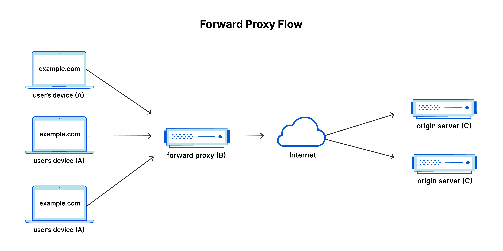
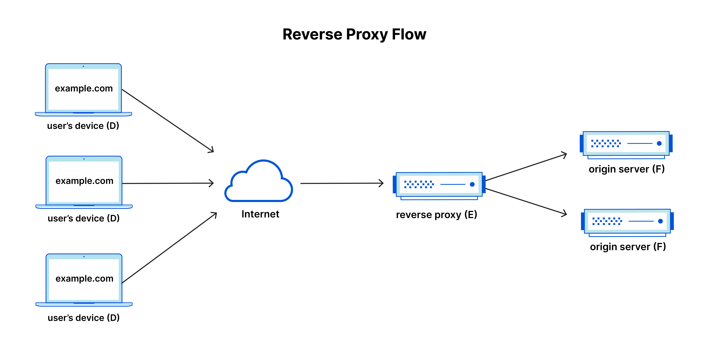
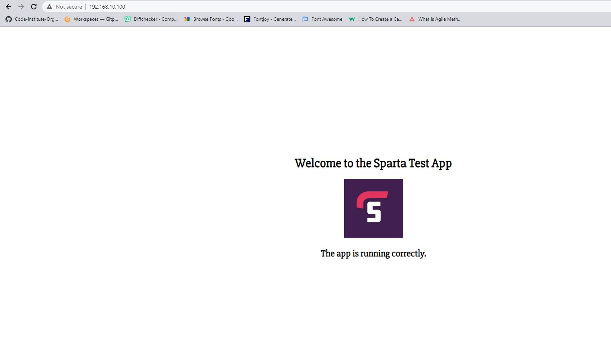

# Proxy and reverse proxy

## What are ports?
Port in computer system is a virtual point where network connections start and end. They are software-based and managed by a computer's OS. 
Each port is associated with a specific task or service, meaning computers can easily differentiate between different kinds of traffic. 
Each port has a number and these numbers can be used to determine the type of the connection or type of protcols used. For example:

* port (22) - used for ssh connection
* port (80) - used for HTTP connection
* port (443) - used for HTTPS connection


## Proxy and reverse proxy

*What is proxy?*
Proxy, or proxy server, is a server that sits in front of the client machine. It intercepts the requests from those machines and then communicates with a web server on behalf of them.




When forward proxy server is in place it works as following:

1. User (A) will try to send a request to the internet
2. Proxy server (B) intercepts that request and then sends it to the origin server (C) on behalf of the user (A)
3. Origin Server (C) responds to the request and send the answer back to proxy server (B)
4. Proxy Server (B) responds back to the user (A)

Reasons using the proxy server:

* To avoid browsing restrictions - for example if a company or institution using firewall restrictions to limit internet access, we can use proxy server in order to go around those limitations, as we will be making requests to proxy then, instead of making a request directly to the websites
* To block access to certain content - oposite of the previous reason, we can set up proxy server with some filters and limits in place that will stop users from accessing unwanted content
* To protect their identity online - proxy server can help you to hide your identity, as only proxy server ip will be visible instead of your personl ip


*What is reverse proxy?*

A reverse proxy is a server that sits in front of the web servers, intercepting the requests from clients.

The difference between proxy and reverse proxy is quite subtle:
forward proxy makes sure that no origin server ever communicates with the client directly, when reverse proxy ensures that no client ever communicates with the origin server directly.




When reverse proxy server is in place it works as following:

1. User (D) will try to send a request to the internet
2. Reverse proxy server (E) intercepts that request and then sends it to the origin server (F)
3. Origin Server (F) responds to the request and send the answer back to proxy server (E)
4. Proxy Server (E) responds back to the user (D)

Why use reverse proxy server:
* Load balancing - websites that have millions of users might be located on multiple servers, and proxy will be responsible of handling the incoming traffic and ensuring that no server is being overloaded
* Protection from attacks - because ip address of the origin server is never revealed it makes it much harder to track that server
* Global Server Load balancing (GSLB) - depending from where user is trying to make a connection, proxy server will guide them towards the server that is closest to them geographically
* Cashing - reverse proxy can cache data to increase the performance
* SSL encryption - it can decrypt incoming requests and encrypt all outgoing responses


## NGINX default configuration

Nginx `sites-available` directory contains config files which specify how nginx should handle connection requests and which ports connect to. By default it listens to incoming connections and directs them to port `80` which is `HTTP` connection port.

## Setting up NGINX as reverse proxy
The following guide explains how to set up nginx as a reverse proxy:

1. Start your VM by using `vagrant up` in VS Code terminal. For this, ensure that `app.js` is not being deployed automatically in your `provisioning.sh`
2. Connect to your VM with Bash terminal by navigating into your project folder with `cd` command and then use `vagrant ssh` command
3. Use command `cd /etc/nginx/sites-available` in order to navigate inside the nginx configuration folder
4. Create a new configuration file with nano by using the following command: `sudo nano nodeapp.conf` (name could be anything, but try to make logical)
5. Inside the file type the following code:

```
server {
   listen 80;
   server_name 192.168.10.100;

   location / {
       proxy_pass http://192.168.10.100:3000;
       proxy_set_header Host $host;
       proxy_set_header X-Real-IP $remote_addr;
       proxy_set_header X-Forwarded-For $proxy_add_x_forwarded_for;
       proxy_set_header X-Forwarded-Proto $scheme;
   }
}
```
    `server_name ***`  - can be the name of your server or your ip address

6. Use `ctrl+x` to exit nano, then press `y` to save the changes, and then press `enter` to save the name of the file
7. Enable the configuration by creating a symbolic link to enable a new config file:
`sudo ln -s /etc/nginx/sites-available/nodeapp.conf /etc/nginx/sites-enabled/nodeapp.conf`
8. Checnk configuration for errors `sudo nginx -t`
9. Reload nginx - `sudo systemctl reload nginx`
10. Go back to your home folder by using `cd` command and then navigate in to `cd app`
11. Launch app by using `node app.js`
12. Paste your ip, without port number, into browser and check if it works:



